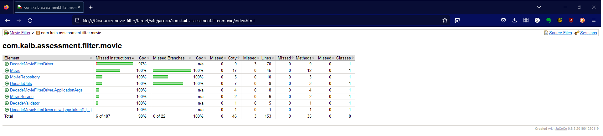
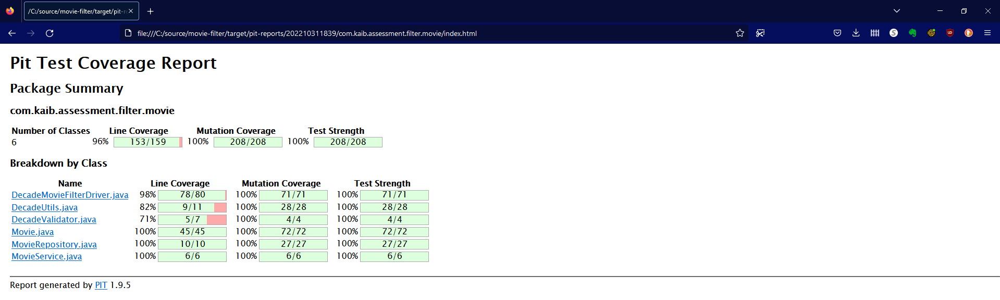
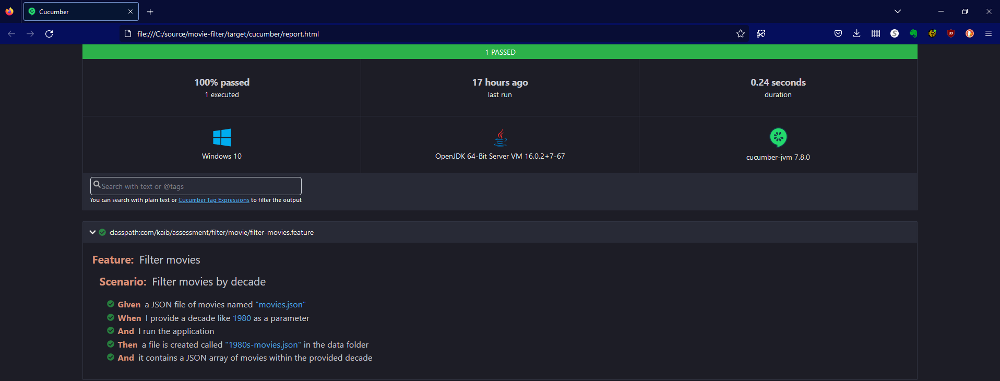
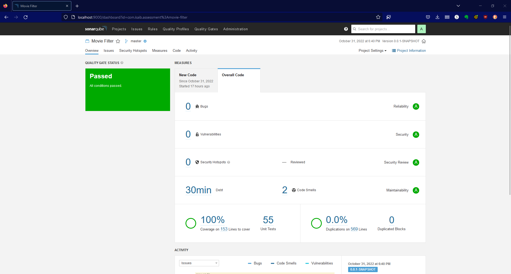
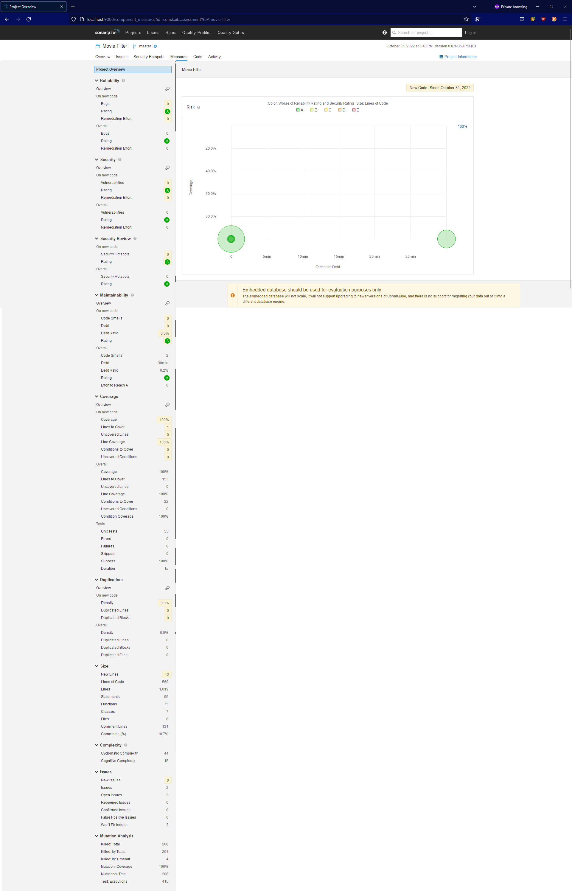
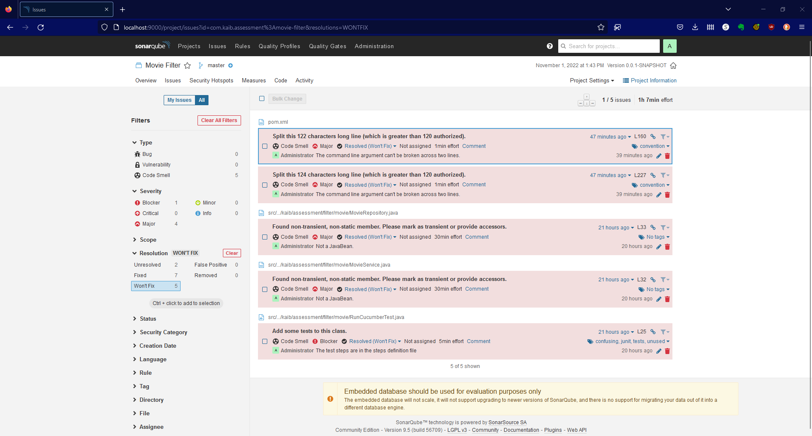

# Movie Filter
## Background
This is the solution to an assessment I did for a job opportunity.  The ask was simple:
  * Filter a JSON file contains movies released in the last 120 years to one
    containing the movies for a single decade
  * Design it as a command line application

The position was for an SDET lead or architect, someone who would work at the
enterprise level.  Testing and quality was implied, so I took a problem that could
have been solved with about ten lines of code and turned it into an over-engineered
solution that demonstrates both good code quality and thorough automated testing.

## Code
I used Java 11 as the JDK and the source JSON file as the data source for a repository
in a layered architecture.  The logic was exposed as a service that could participate
in a [hexagonal architecture](https://en.wikipedia.org/wiki/Hexagonal_architecture_%28software%29).
The adapter in this case is a straightforward driver class that:
  1. Configures the application
  2. Validates the command line arguments
  3. Invokes the service
  4. Serializes the output to a JSON structure
  5. Writes the JSON file as a file to a user-defined location

### Validation
Defensive validation is performed in all application layers.

## Testing
I wrote JUnit tests to verify application behavior.  Testing the command line argument
validation was the most difficult part because trapping the `System.exit()` call
required a custom security manager to prevent the test run from stopping with an
error.  I used [JMockit](https://jmockit.github.io/) as the mocking framework.

I used [Pitest](https://pitest.org) to grade the quality of the unit tests.

Basic BDD was provided to illustrate the business requirements for the filter.  I
converted it to a valid Gherkin file and used it to add Cucumber integration testing
to the assessment solution.

## Metrics
A Maven build compiles, tests, and analyzes the project.  Code coverage, mutation
coverage, and Cucumber reports are generated by [JaCoCo](https://www.jacoco.org/jacoco/),
[Pitest](https://pitest.org), and [Cucumber](https://cucumber.io/), respectively.
[SonarQube](https://www.sonarsource.com/) analyzes the source code using a 1,625 rule
Java quality profile and a 35 rule XML quality profile. Note: The Java quality
profile contains rules from four repositories, three external:
  * PMD
  * FindBugs/Spotbugs (including FindBugs Security)
  * CheckStyle

and the internal SonarQube rule repository.  The quality profiles are included in
the Git repository.

There are some duplicates between the three external repos and the internal SonarQube
one, so the total number of distinct rules will be lower.  Irrelevant here because
the project has almost zero debt.

### JaCoCo
The JaCoCo code coverage report shows 98% coverage.  Private constructors can't
be covered by unit tests, so the number is not 100%.

### Pitest
The Pitest mutation coverage report shows 100% coverage.  Constructors aren't mutated
by Pitest.

27 code mutation strategies were used in this analysis:

  * EXPERIMENTAL_ARGUMENT_PROPAGATION
  * FALSE_RETURNS
  * TRUE_RETURNS
  * CONDITIONALS_BOUNDARY
  * CONSTRUCTOR_CALLS
  * EMPTY_RETURNS
  * INCREMENTS
  * INLINE_CONSTS
  * INVERT_NEGS
  * MATH
  * NEGATE_CONDITIONALS
  * NON_VOID_METHOD_CALLS
  * NULL_RETURNS
  * PRIMITIVE_RETURNS
  * REMOVE_CONDITIONALS_EQUAL_IF
  * REMOVE_CONDITIONALS_EQUAL_ELSE
  * REMOVE_CONDITIONALS_ORDER_IF
  * REMOVE_CONDITIONALS_ORDER_ELSE
  * VOID_METHOD_CALLS
  * EXPERIMENTAL_BIG_DECIMAL
  * EXPERIMENTAL_BIG_INTEGER
  * EXPERIMENTAL_MEMBER_VARIABLE
  * EXPERIMENTAL_NAKED_RECEIVER
  * REMOVE_INCREMENTS
  * EXPERIMENTAL_SWITCH
  * EXPERIMENTAL_BIG_DECIMAL
  * EXPERIMENTAL_BIG_INTEGER

They generated 208 code mutations, all of which were caught by the unit test suite.

### Cucumber
The Cucumber test results show the sole integration test passed.

### SonarQube
SonarQube shows .2% technical debt across 574 lines of Java and XML code.  I would
argue in a code review that the two violations are false positives given their
context.

#### The Project Dashboard

#### The Project Measures

#### "Won't Fix" Violations
There were five SonarQube violations I marked as "Won't fix"

